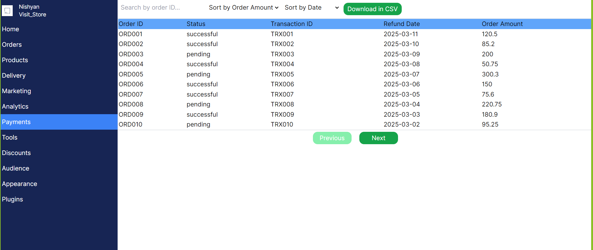
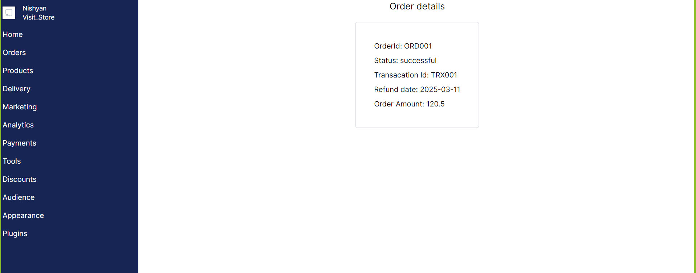

# Next.js Dashboard Web App with Tailwind CSS

This project is a responsive web application developed using Next.js and Tailwind CSS. The app implements a dashboard design and includes functionalities such as pagination, search, sorting, and CSV download for a transactions table. It also includes a sidebar for navigation and dynamic routes for detailed transaction pages.

## Important Links

- [Deployed Link](https://workwise-frontend.vercel.app/)

- [Repo Link](https://github.com/artisonii/workwise_frontend)

## Features

- **Sidebar Navigation**: Navigate to different pages using the sidebar. The sidebar remains consistent across all pages.
- **Transaction Table**:
  - Pagination.
  - Search functionality to filter transactions by Order ID.
  - Sorting by Order Amount (Low to High and High to Low) and Date (Latest to Oldest and Oldest to Latest).
  - CSV download functionality.
  - Clicking on an Order ID redirects to a detailed transaction page.

## Technologies Used

- **Next.js**: For web app development.
- **Tailwind CSS**: For styling and design.
- **Java Script**: For Functionality.

## Screenshots

- For Transaction This Month Table Section

- For Transaction Details

# Created by Arti Soni

- [LinkedIn](https://www.linkedin.com/in/arti-soni/)
- [Portfolio](https://artisonii.github.io/)
- [GitHub](https://github.com/artisonii)
